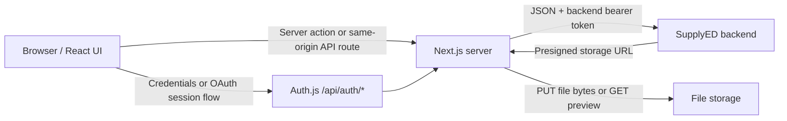
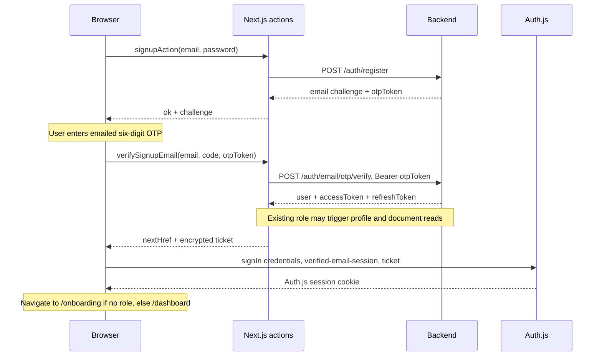
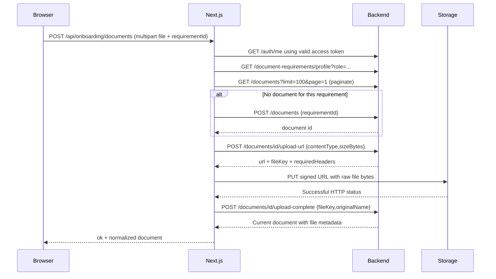

AUTH_SECRET="replace-with-a-long-random-secret"
AUTH_URL="http://localhost:3000"


# SupplyED authentication, profiles, and document upload flows

Code review date: 22 September 2026. This describes the current working tree, including local edits present when reviewed.

This repository contains the Next.js application and its server-side integration with a separate backend. Backend controllers, database models, email delivery, signing keys, storage configuration, and administrative approval logic are not present here. Request paths, payloads, UI sequences, and frontend-generated errors below are taken from the code. **Backend JSON examples are illustrative payloads compatible with the frontend readers, not captured responses or a verified backend specification.** Backend HTTP status codes in examples are illustrative unless explicitly described as generated or handled by this frontend. IDs, credentials, token values, dates, storage URLs, and expiration durations in examples are placeholders.

## Login document gate update

The login-to-upload routing has been updated after the original code review. See [Login and required document flow](login-required-documents-flow.md) for the current API order, redirect decisions, and regression checks. Existing profiles with missing required files open the document upload stage at `/onboarding`. After uploads are complete, **Continue to dashboard** checks the files again, submits the profile for review when needed, updates the session, and opens `/dashboard`. Pending review no longer replaces the dashboard with the full-screen review page; other approval-dependent pages remain restricted. Suspended accounts retain their paused-account screen.

The detailed inventory below records the earlier review snapshot; unrelated implementations may have changed since that review. The linked update takes precedence for login/document routing.

## Contents

1. [URLs and architecture](#1-urls-and-architecture)
2. [API inventory](#2-api-inventory)
3. [Response and error formats](#3-response-and-error-formats)
4. [Signup and email verification](#4-signup-and-email-verification)
5. [Login and two-factor login](#5-login-and-two-factor-login)
6. [Forgot password and reset code](#6-forgot-password-and-reset-code)
7. [Google and Microsoft sign-in](#7-google-and-microsoft-sign-in)
8. [Tokens, cookies, refresh, and logout](#8-tokens-cookies-refresh-and-logout)
9. [Profile creation and onboarding](#9-profile-creation-and-onboarding)
10. [Document upload, replacement, and preview](#10-document-upload-replacement-and-preview)
11. [Review status and verification](#11-review-status-and-verification)
12. [Profile editing and profile photo upload](#12-profile-editing-and-profile-photo-upload)
13. [Two-factor account management](#13-two-factor-account-management)
14. [Current implementation caveats](#14-current-implementation-caveats)
15. [Source map and verification scope](#15-source-map-and-verification-scope)

## 1. URLs and architecture

### Configured addresses

Only non-secret URL/settings values are reproduced here.

| Setting | Current local `.env` | `.env.example` |
|---|---|---|
| `API_BASE_URL` | `http://localhost:3003/api` | `http://localhost:3000/api` |
| `AUTH_URL` | `http://localhost:3000` | `http://localhost:3002` |
| `NEXT_PUBLIC_SITE_URL` | `http://localhost:3000` | `http://localhost:3002` |
| `AUTH_BACKEND_OAUTH_ENABLED` | `false` | `false` |

In this guide:

- `FRONTEND` = `http://localhost:3000` with the current local configuration.
- `BACKEND` = `http://localhost:3003/api` with the current local configuration.
- Backend paths such as `/auth/login` normally mean `BACKEND + /auth/login`, giving `http://localhost:3003/api/auth/login`.
- Frontend paths such as `/api/onboarding/documents` mean `FRONTEND + /api/onboarding/documents`, giving `http://localhost:3000/api/onboarding/documents`.
- Signed storage URLs are returned dynamically by the backend. A production backend hostname and storage bucket URL cannot be established from these local settings.

The shared API client preserves the `/api` base path. **Automatic token refresh uses a different URL builder and is an exception:** it currently calls `http://localhost:3003/auth/refresh`. See section 8.

### Who talks to whom



The browser normally uses the Auth.js session cookie. The Next.js server extracts backend tokens and calls the backend. In the implemented document flow, file bytes go **browser → Next.js upload route → signed storage URL**. The backend receives document metadata and completion requests, rather than the file bytes through its JSON endpoints.

Authentication form submissions use Next.js Server Actions imported from `app/(auth)/*/actions.ts`. They are not custom REST endpoints such as frontend `POST /api/auth/login`. Auth.js has a separate catch-all handler at `app/api/auth/[...nextauth]/route.ts`.

## 2. API inventory

### Backend authentication endpoints

All paths in this table use `BACKEND`, except the automatic-refresh exception already noted.

| Method | Path | Authorization used by this code | Purpose |
|---|---|---|---|
| POST | `/auth/register` | None | Register email/password; receive verification challenge |
| POST | `/auth/email/otp/resend` | None | Issue another email verification challenge |
| POST | `/auth/email/otp/verify` | `Bearer <email otpToken>` | Verify email OTP; receive authenticated user/tokens |
| POST | `/auth/login` | None | Password login; may return verification or 2FA branch |
| POST | `/auth/2fa/verify` | `Bearer <twoFactorToken>` | Finish challenged login |
| POST | `/auth/password/forgot` | None | Request password reset challenge |
| POST | `/auth/password/reset` | `Bearer <reset otpToken>` | Submit OTP and new password together |
| POST | `/auth/oauth/google` | None; Google ID token in JSON | Exchange Google identity for backend session |
| POST | `/auth/refresh` | Refresh token in JSON | Obtain new backend access token/token pair |
| GET | `/auth/me` | `Bearer <accessToken>` | Read live user, role, and verification flags |
| GET | `/auth/2fa/status` | Access token | Read 2FA status |
| POST | `/auth/2fa/setup` | Access token | Start authenticator setup |
| POST | `/auth/2fa/enable` | Access token | Confirm setup and receive recovery codes |
| POST | `/auth/2fa/disable` | Access token | Disable 2FA using a code |
| POST | `/auth/2fa/recovery-codes` | Access token | Regenerate recovery codes |

### Backend profile and file endpoints

All use an access token through the shared API client or an explicitly supplied bearer header.

| Method | Path | Purpose |
|---|---|---|
| PATCH | `/users/me` | Update account name/phone |
| GET | `/instructors/me` | Read teacher profile |
| POST | `/instructors` | Create teacher profile |
| PATCH | `/instructors/me/status` | Submit teacher profile for review; no JSON body |
| GET | `/institutions/me` | Read school/institution profile |
| POST | `/institutions` | Create school/institution profile |
| PATCH | `/institutions/me/status` | Submit institution for review; no JSON body |
| GET | `/recruiters/me` | Read individual hiring profile |
| POST | `/recruiters` | Create individual hiring profile |
| PATCH | `/recruiters/me/status` | Submit individual profile; no JSON body |
| PATCH | `/instructors/{profileId}` | Edit existing teacher profile in settings |
| GET | `/instructors/{profileId}` | Settings fallback if teacher `/me` is unavailable |
| PATCH | `/institutions/{profileId}` | Edit existing institution profile in settings |
| PATCH | `/recruiters/me` | Edit existing individual profile in settings |
| GET | `/document-requirements/profile?role=INSTRUCTOR` | Load requirements; role is `INSTRUCTOR`, `INSTITUTION`, or `RECRUITER` |
| GET | `/document-requirements/application` | Separate application-requirement catalogue |
| GET | `/documents?limit=100&page=1` | List owned documents; continue pagination as needed |
| POST | `/documents` | Create document metadata row |
| POST | `/documents/{documentId}/upload-url` | Get signed PUT URL and file key |
| PUT | Absolute signed storage URL | Upload raw bytes with returned headers; no app bearer token added |
| POST | `/documents/{documentId}/upload-complete` | Make uploaded file current |
| GET | `/documents/{documentId}/download-url` | Get temporary file read URL |
| GET | `/users/me/profile-image` | Get current signed profile image URL |
| POST | `/users/me/profile-image/upload-url` | Get signed profile image upload URL |
| POST | `/users/me/profile-image/upload-complete` | Complete profile image upload |

### Browser-facing routes and action entry points

| UI operation | Frontend entry | Backend work |
|---|---|---|
| Signup | `/signup` → `signupAction` | Register, optionally resend |
| Email verification | `verifySignupEmail` or `verifyLoginEmail` | Verify OTP, read existing profile/documents when applicable, mint session ticket |
| Login | `/login` → `loginAction` | Login, profile/document lookup when applicable |
| 2FA login | `verifyLoginTwoFactor` | Verify challenge, build ticket |
| Reset | `/forgot-password` → `requestPasswordResetAction` / `confirmPasswordResetAction` | Forgot/reset endpoints |
| Session creation | `signIn("credentials", { flow: "verified-email-session", ticket })` | Auth.js consumes ticket; does not repeat backend login |
| Current user | GET `/api/auth/me` | GET backend `/auth/me`; normalize user |
| Onboarding state | GET `/api/onboarding/me` | Live user, requirements/documents, role profile |
| Requirements | GET `/api/onboarding/document-requirements?role=teacher` | GET backend requirements with `role=INSTRUCTOR` |
| Save a step | `saveOnboardingStep` | Reads requirements/document state; does not create/update profile |
| Create/review profile | `saveOnboardingAction` | Account basics, role profile, document checks, optional status transition |
| Onboarding upload | POST `/api/onboarding/documents` | Multipart input → document upload pipeline |
| Preview preparation | `downloadOnboardingDocument` | Get download URL; return local preview route |
| Preview bytes | GET `/api/onboarding/documents/{id}/preview?name=file.pdf` | Get a fresh download URL, stream storage response |
| General/application documents | GET or POST `/api/documents`, optional `applicationId` | Read workspace or upload file |
| Settings | GET `/api/settings/profile`; `updateSettingsAction` | Load/update user and role profile |
| Profile photo | `uploadSettingsProfileImageAction` | Signed upload pipeline |

## 3. Response and error formats

### Backend JSON and envelope unwrapping

The server API client accepts a direct payload, or an envelope containing `data` and either `success` or `message`. For example:

```json
{
  "success": true,
  "message": "Request completed",
  "data": {
    "user": {
      "id": "user-example",
      "email": "teacher@example.com",
      "emailVerified": true,
      "role": "INSTRUCTOR"
    },
    "accessToken": "<backend-access-token>",
    "refreshToken": "<backend-refresh-token>",
    "accessTokenExpiresInSeconds": 900
  }
}
```

`api.post()` returns the contents of `data` for this example. Tokens may also be nested under `tokens`. HTTP 204 becomes `undefined`. Error detection uses the HTTP result; a `success: false` value on an HTTP 2xx envelope is not independently treated as a failed request by the generic client.

### Server Action result

The frontend's own action result has `ok`, rather than the backend's optional `success` envelope:

```json
{
  "ok": true,
  "data": {
    "nextHref": "/onboarding",
    "ticket": "<encrypted-short-lived-session-ticket>"
  },
  "message": "Credentials accepted."
}
```

Exact frontend validation example:

```json
{
  "ok": false,
  "message": "Use a valid email address.",
  "fieldErrors": {
    "email": "Use a valid email address."
  }
}
```

### Backend error → UI error

Illustrative backend HTTP 400 body:

```json
{
  "statusCode": 400,
  "message": ["phone must be valid", "name must not be empty"],
  "error": "Bad Request"
}
```

The shared client joins message arrays, builds `ApiError(message, status, payload, code)`, and supports error codes inside recognized envelopes. Most auth/onboarding actions return only `{ "ok": false, "message": "..." }`; they do not preserve every backend code/status. Settings actions additionally preserve `ApiError.code`. `routeError()` preserves an `ApiError` payload/status, but returns HTTP 500 `{ "message": "Unexpected server error." }` for other exceptions.

Automatic session-expiry response generated by the client:

```json
{
  "code": "SESSION_EXPIRED",
  "message": "Your session expired. Sign in again to continue."
}
```

The API client uses a 15-second timeout by default, `Accept: application/json`, JSON content type except for FormData, and manual redirect handling. Storage uploads and the direct automatic refresh helper have their own fetch behavior described below.

## 4. Signup and email verification

### Exact normal order



1. UI sends email and password; email is trimmed/lowercased.
2. Signup validation requires a valid email and at least eight password characters, one uppercase letter, one digit, and one special character. The code does not require a lowercase letter.
3. `POST http://localhost:3003/api/auth/register` sends only:

```json
{
  "email": "teacher@example.com",
  "password": "ExamplePassword1!"
}
```

Compatible backend response:

```json
{
  "code": "EMAIL_VERIFICATION_REQUIRED",
  "email": "teacher@example.com",
  "emailVerified": false,
  "expiresInMinutes": 10,
  "otpToken": "<email-verification-challenge-token>"
}
```

4. The browser keeps the email challenge token in React state and switches from the account form to the verification form. Signup alone does not establish the authenticated session.
5. `verifySignupEmail` forwards to `verifyEmailSessionAction`. It validates the email, six-digit code, and presence of `otpToken`.
6. `POST http://localhost:3003/api/auth/email/otp/verify` sends:

```http
Authorization: Bearer <email-verification-challenge-token>
Content-Type: application/json

{"otp":"123456"}
```

The form's `code` is renamed to backend `otp`. Email and password are not sent in this verification body.

Compatible response:

```json
{
  "user": {
    "id": "user-example",
    "email": "teacher@example.com",
    "emailVerified": true,
    "role": "USER",
    "accountStatus": "INCOMPLETE"
  },
  "accessToken": "<backend-access-token>",
  "refreshToken": "<backend-refresh-token>",
  "accessTokenExpiresInSeconds": 900
}
```

`USER` becomes frontend role `null`. This means the email account exists but no teacher/institution/individual profile is selected yet.

7. The server returns a ticket, not raw backend tokens, through the action used by the signup/login screens. Auth.js consumes that ticket and the browser navigates to `nextHref`.

### Resend and duplicate signup

`POST http://localhost:3003/api/auth/email/otp/resend`:

```json
{"email":"teacher@example.com"}
```

Compatible response:

```json
{
  "email": "teacher@example.com",
  "emailVerified": false,
  "otpToken": "<replacement-email-challenge-token>",
  "expiresInMinutes": 10,
  "message": "A verification code has been sent."
}
```

The UI replaces the previous challenge token and uses `expiresInMinutes` as its resend cooldown. Its countdown is `Date.now() + expiresInMinutes * 60_000`; this does not establish the backend's actual expiration or rate-limit policy.

If register throws `EMAIL_ALREADY_REGISTERED`, `EMAIL_VERIFICATION_PENDING`, `EMAIL_VERIFICATION_REQUIRED`, or a matching HTTP 409 message, the action calls resend automatically:

- Still unverified: return a pending-signup challenge and explain that the original signup password still applies (`passwordUpdated: false`).
- Already verified: return `ok: false`, code `EMAIL_ALREADY_REGISTERED`, and email field error `This email is already registered. Log in instead.`

Illustrative register conflict:

```json
{"code":"EMAIL_ALREADY_REGISTERED","message":"Email is already registered."}
```

Illustrative backend OTP failure (for example HTTP 400):

```json
{"message":"The verification code is invalid or expired."}
```

Exact frontend missing-challenge failure:

```json
{
  "ok": false,
  "message": "Request a new verification code before verifying this email.",
  "fieldErrors": {"code":"Request a new verification code before verifying this email."}
}
```

A register error with HTTP status 500 or above produces a message warning that the account may already have been saved and to retry with the same email/password. If email verification succeeds but Auth.js ticket sign-in fails, the UI asks the user to log in again.

## 5. Login and two-factor login

### Password login

`/login` → `loginAction` → `loginWithEmailAction` → `loginWithEmail`:

```http
POST http://localhost:3003/api/auth/login
Content-Type: application/json

{"email":"teacher@example.com","password":"ExamplePassword1!"}
```

Login checks valid email and password length of at least eight. It does not reapply the full signup strength rule.

Compatible successful response:

```json
{
  "user": {
    "id": "user-example",
    "email": "teacher@example.com",
    "name": "Alex Teacher",
    "emailVerified": true,
    "role": "INSTRUCTOR",
    "instructorProfileId": "instructor-example",
    "accountStatus": "APPROVED",
    "isFullyVerified": true
  },
  "tokens": {
    "accessToken": "<backend-access-token>",
    "refreshToken": "<backend-refresh-token>"
  },
  "accessTokenExpiresInSeconds": 900
}
```

Next calls before issuing the ticket:

1. If role is teacher/institution/individual and an access token exists, GET the corresponding `/instructors/me`, `/institutions/me`, or `/recruiters/me` using that new access token.
2. Normalize profile status. `suspended` returns immediately; `none` or `rejected` becomes `none` for this login status calculation.
3. Otherwise GET requirements and GET paginated documents concurrently. Missing required/replacement documents makes this login status `none`.
4. A profile GET error of 403/404 produces status `none`; other failures propagate and can prevent ticket creation even after credentials were accepted.
5. Create ticket → browser calls Auth.js credentials sign-in → set session cookie → navigate. **The entry-route helper sends an account without a role or with effective status `none` to `/onboarding`.** Existing profiles there open the document stage. Submitted profiles whose required uploads are complete can enter `/dashboard`, including pending-review profiles. See the login document gate update above.

Illustrative wrong-password response (for example HTTP 401):

```json
{"message":"Invalid email or password."}
```

Since login uses `auth: false`, this is shown as a login error and does not trigger automatic refresh.

### Unverified-email login branch

There are two code paths:

- A successful login payload with `user.emailVerified: false` becomes an email-verification challenge using its `otpToken`. The frontend does not separately resend in this branch, although its message says a code was sent.
- A thrown API error identified as `EMAIL_NOT_VERIFIED`, `EMAIL_VERIFICATION_PENDING`, `EMAIL_VERIFICATION_REQUIRED`, or a matching HTTP 403 message triggers `POST /auth/email/otp/resend` automatically.

Then `verifyLoginEmail` uses the same verification-plus-ticket flow as signup. A resend response saying already verified returns `EMAIL_ALREADY_VERIFIED` and asks the user to log in again.

### Two-factor login branch

Compatible response from password login:

```json
{
  "twoFactorRequired": true,
  "twoFactorToken": "<short-lived-two-factor-challenge-token>",
  "expiresInMinutes": 5
}
```

No authenticated session is established yet. The action normalizes this to include `code: "TWO_FACTOR_REQUIRED"` and the submitted email. The UI switches to an authenticator/recovery-code screen.

Next request:

```http
POST http://localhost:3003/api/auth/2fa/verify
Authorization: Bearer <short-lived-two-factor-challenge-token>
Content-Type: application/json

{"code":"123456"}
```

Accepted frontend formats are six digits or four groups of four recovery-code characters separated by hyphens, using `A-H`, `J-N`, `P-Z`, and `2-9`. Example shape: `ABCD-EFGH-JKLM-NPQR`. The code is trimmed and uppercased.

The successful backend response uses the same authenticated user/token shape as normal login. It then follows profile lookup → ticket → Auth.js session → redirect.

Exact local error examples:

```json
{"ok":false,"message":"Sign in again before entering your two-factor code.","fieldErrors":{"code":"Sign in again before entering your two-factor code."}}
```

```json
{"ok":false,"message":"Enter a 6-digit authenticator code or a valid recovery code.","fieldErrors":{"code":"Enter a 6-digit authenticator code or a valid recovery code."}}
```

An illustrative backend verification error is `{ "message": "Invalid authentication code." }`; its message is displayed. A `twoFactorRequired: true` response without `twoFactorToken` is rejected by the frontend normalizer.

## 6. Forgot password and reset code

```text
/forgot-password
  → POST /auth/password/forgot { email }
  → store reset otpToken in component state
  → enter emailed code + new password + confirm password
  → POST /auth/password/reset with Bearer reset otpToken
  → success screen
  → /login
  → normal login flow
```

### Request or resend reset code

```http
POST http://localhost:3003/api/auth/password/forgot
Content-Type: application/json

{"email":"teacher@example.com"}
```

Compatible response:

```json
{"otpToken":"<password-reset-challenge-token>","expiresInMinutes":10}
```

The action shows: `Check your email for a 6-digit reset code. If this address is registered, it should arrive shortly.` The UI requires a returned `otpToken` to advance. It cannot complete reset from a generic success response without that token.

“Send new code” calls the **same forgot endpoint again** and replaces the token. There is no separate reset-code resend endpoint in this code. Challenge state is in memory and is lost on a full page reload.

### Submit code and password

```http
POST http://localhost:3003/api/auth/password/reset
Authorization: Bearer <password-reset-challenge-token>
Content-Type: application/json

{"otp":"123456","password":"NewExamplePassword2!"}
```

Compatible response:

```json
{"passwordReset":true}
```

The new password uses the signup strength rule. Confirm-password matching is checked in the UI; `confirmPassword` is not sent to this server action or backend. **There is no standalone “verify reset code” API call:** OTP validation and password change happen in this one request.

After any successful action result, the UI clears password/code/token state and shows a login button. It does not automatically create a session or consume a new access/refresh pair. The backend reader defaults a missing `passwordReset` field to `true`; the UI checks `result.ok`, not the boolean itself.

Exact local failure:

```json
{"ok":false,"message":"Request a new reset code before changing your password.","fieldErrors":{"code":"Request a new reset code before changing your password."}}
```

Illustrative backend failure:

```json
{"message":"The reset code is invalid or expired."}
```

Existing-session revocation after password reset is a backend concern and cannot be confirmed from this repository.

## 7. Google and Microsoft sign-in

Google sequence:

1. Browser calls `signIn("google", { redirectTo: "/post-auth?authSource=login" })`, or `authSource=signup`.
2. Auth.js handles provider authorization/callback using configured client credentials. The Google provider requests `access_type=offline`, `prompt=consent`, and `response_type=code`.
3. On the server, the Auth.js JWT callback receives the provider account, including its Google ID token.
4. With `API_BASE_URL` configured, backend exchange also requires `AUTH_BACKEND_OAUTH_ENABLED === "true"`.
5. Server calls:

```http
POST http://localhost:3003/api/auth/oauth/google
Content-Type: application/json

{"credential":"<google-id-token>"}
```

6. Backend returns the normal authenticated user/access/refresh payload. These are the SupplyED backend tokens; they are distinct from Google tokens.
7. Auth.js puts backend auth data in its session JWT. `/post-auth` loads live profile data and routes by role.

Typical frontend provider callbacks, handled by Auth.js, are `/api/auth/callback/google` and `/api/auth/callback/microsoft-entra-id` on `FRONTEND`.

Current limitations and errors:

- The local exchange flag is `false`, so live backend social sign-in is disabled even if Google credentials exist.
- Provider button availability checks credentials, not the backend exchange flag.
- Microsoft has an Auth.js provider but no implemented backend exchange; it throws `Microsoft sign-in is not connected to the SupplyED backend yet.` when backend exchange is enabled.
- Google exchange requires a returned ID token. Missing token: `Google did not return an ID token for backend sign-in.`
- A backend 2FA challenge during Google exchange is rejected with instructions to use email/password for the security-code flow.
- Exchange failure records `OAuthBackendExchangeError`, removes backend tokens/role/profile IDs, and exposes an auth error message. `/post-auth` signs out and returns to the original login/signup screen with `auth_error`.

No Microsoft backend URL should be inferred from the Google endpoint.

## 8. Tokens, cookies, refresh, and logout

### Each token's job

| Item | Where it comes from | Where it goes | Lifetime/storage in this code |
|---|---|---|---|
| Email OTP code | Backend email delivery, outside this repo | JSON `otp` to email verification | User enters six digits; actual expiry is backend-owned |
| Email `otpToken` | Register/resend or unverified login | Bearer header on email OTP verify | Browser component state; replaced on resend |
| Reset OTP code | Backend email delivery | JSON `otp` alongside new password | User enters six digits |
| Reset `otpToken` | Password-forgot response | Bearer header on password reset | Browser component state; separate purpose from email verification |
| `twoFactorToken` | Password-login challenge | Bearer header on `/auth/2fa/verify` | Browser component state until login completes/restarts |
| Backend `accessToken` | Login, email verify, 2FA verify, Google exchange, refresh | `Authorization: Bearer ...` on protected backend calls | Stored inside Auth.js encrypted session JWT; used server-side |
| Backend `refreshToken` | Same authenticated token responses; may rotate on refresh | JSON `{ refreshToken }` to refresh endpoint | Stored inside Auth.js encrypted session JWT; used server-side |
| Session ticket | Next.js creates from verified backend response | Browser passes it to Auth.js credentials provider | AES-256-GCM encrypted; 60 seconds |
| Auth.js session JWT/cookie | Auth.js after credentials/OAuth success | Browser automatically sends cookie to Next.js | Encrypted Auth.js token; distinct from backend JWTs |
| Google ID/access token | Google OAuth callback | ID token exchanged server-side for SupplyED tokens | Not used as the SupplyED backend bearer token |
| Signed file URL | Backend file endpoint | Storage PUT/GET | Temporary capability URL; expiry supplied by backend/storage |

An access token authorizes ordinary backend requests. A refresh token is used to obtain another access token after expiry without asking for the password again. This application does not issue backend access/refresh tokens itself and does not define their actual lifetimes.

### Auth.js session construction

`auth.ts` uses JWT session strategy. The JWT callback stores:

```text
userId, role, applicationStatus, appEmailVerified,
instructorProfileId, institutionProfileId, recruiterProfileId,
accessToken, refreshToken, accessTokenExpiresAt
```

The browser-visible session callback exposes user ID, name/email, role, status, email-verification flag, profile IDs, and auth error metadata. It **does not expose accessToken or refreshToken** through the normal session object. No access/refresh storage in `localStorage` or `sessionStorage` was found in these flows. Founding signup intent uses session storage for form prefill, not for backend tokens.

The installed Auth.js implementation uses `authjs.session-token` on HTTP and `__Secure-authjs.session-token` when secure cookies are selected, with `httpOnly: true`, `sameSite: "lax"`, and `path: "/"`. Auth.js can split a large session token across cookie chunks. Its default JWT encryption is distinct from the application's AES-GCM ticket encryption. `auth.ts` does not override session max age; do not confuse the library session lifetime with backend access-token expiry.

`getServerAuthContext()` calls `auth()` and `getToken()` against request headers to recover the backend tokens. Secret resolution is `AUTH_SECRET`, then `NEXTAUTH_SECRET`, then a development-only fallback; production requires a configured secret. Secret values are deliberately not reproduced here.

### Why the extra session ticket exists

Normal password/OTP authentication already happened through a server action. The server packages that verified result in an encrypted ticket and returns `{ ticket, nextHref }`. The browser then invokes:

```ts
await signIn("credentials", {
  flow: "verified-email-session",
  redirect: false,
  redirectTo: nextHref,
  ticket,
});
```

The credentials provider decrypts the ticket, checks its expiry and `user.emailVerified === true`, and creates the session without another backend login/OTP request. The ticket holds backend tokens encrypted, has a random 12-byte IV, and uses a SHA-256-derived key from the auth secret. There is no consumed-ticket registry: it expires after 60 seconds but is not explicitly single-use.

There are also direct credentials-provider `password` and `verify-email` branches in `auth.ts`. The current login/signup screens use the ticket branch. A separate exported `verifyEmailAction` returns the normalized backend response, but the current route wrappers use `verifyEmailSessionAction` instead.

### Access-token expiration parsing

The response normalizers accept:

1. `accessTokenExpiresAt` or `expiresAt`, at top level or within `tokens`, as numeric timestamps. Values below `10_000_000_000` are interpreted as seconds and multiplied by 1,000.
2. Supported ISO date strings (`accessTokenExpiresAt`, `expiresAt`, or `tokens.expiresAt`).
3. Relative seconds: top-level `accessTokenExpiresInSeconds`, `accessTokenExpiresIn`, `expiresIn`, or token-level `accessTokenExpiresInSeconds` / `accessTokenExpiresIn`.
4. Otherwise decode JWT `exp` and convert seconds to milliseconds.

JWT decoding here is explicitly unverified parsing for metadata. It does not validate the backend token signature. No fixed “15-minute access token” or “7-day refresh token” policy can be claimed from this frontend; `900` in examples is only an example.

### Automatic refresh sequence

For ordinary `api.get/post/patch/...` calls with auth enabled:

```text
Read Auth.js cookie → getServerAuthContext()
  → getValidAccessToken()
      → no expiry known or more than roughly 60 seconds left: use current token
      → near expiry: POST automatic refresh with refreshToken
  → call requested API with access token
  → if HTTP 401 / 302 / 307 / 308 and refresh token exists:
      POST automatic refresh → retry original API once
  → if final backend response is an auth failure:
      mark session expired → throw SESSION_EXPIRED (401)
```

The exact expiry condition refreshes when `Date.now() > expiresAt - 60_000`. A missing access token returns `null` immediately; a refresh-token-only session is not proactively restored by `getValidAccessToken()`.

Automatic refresh sends:

```http
POST http://localhost:3003/auth/refresh
Content-Type: application/json

{"refreshToken":"<backend-refresh-token>"}
```

**That URL is the current implementation, not a typo in this guide.** `new URL("/auth/refresh", baseUrl)` replaces `/api`. Explicit `refreshBackendAuth()` in `features/auth/backend.ts` uses the shared API client and instead calls:

```http
POST http://localhost:3003/api/auth/refresh
Content-Type: application/json

{"refreshToken":"<backend-refresh-token>"}
```

Compatible automatic-refresh response:

```json
{
  "accessToken": "<new-access-token>",
  "refreshToken": "<new-refresh-token-if-rotated>",
  "accessTokenExpiresInSeconds": 900
}
```

The explicit auth refresh normalizer additionally expects a valid user object with ID/email, like the login response. This is used by `refreshApplicationStatusAction`, which returns another ticket after re-reading profile/document state.

Persistence after automatic refresh calls `updateAuthSession({ backendAuthUpdate: ... })`. Before accepting a token update, `auth.ts` checks decoded access-token `sub` matches the session user and `tokenType === "access"`; if a new refresh token exists, its decoded `sub` and `tokenType === "refresh"` must also match. These are structural checks, not cryptographic signature verification. Cookie update failures are swallowed so the current request can still use the returned token. Consequently refresh may work for one request without being persisted.

If the backend omits a replacement refresh token, the stored one is retained. There is no refresh de-duplication lock in this code. Concurrent requests can refresh independently. A proactive refresh followed by a retry can also issue another refresh using the original request context's refresh token.

An illustrative refresh failure is HTTP 401 `{ "message": "Refresh token expired." }`. Non-OK automatic refresh or missing access token in its response attempts to mark the session expired. Network/JSON exceptions from that helper can propagate directly. Unlike the shared client, the automatic helper has no explicit request timeout.

Calls made with `auth: false` plus an explicit bearer header bypass this automatic mechanism. This is used for OTP challenges, newly obtained login tokens, and several onboarding/document operations after `getOnboardingAuth()` obtains a valid access token.

### Logout and expiration handling

UI logout calls `signOut({ redirect: false })`, then navigates to `/login`. There is no backend logout/revoke endpoint called in the inspected code. Clearing the Auth.js session therefore does not establish that the backend refresh token was revoked.

`fetchJson()` signs out and navigates to `/login` when a frontend GET returns HTTP 401 or top-level `code: "SESSION_EXPIRED"`. Server Action and upload failures may instead display a message because they use different result handlers. Session-expiry handling does not guarantee every screen immediately redirects.

## 9. Profile creation and onboarding

### Account versus role profile

Email signup creates an authenticated account after verification. A second stage creates its role-specific profile:

| UI role | Backend role/request value | Resource | Document context |
|---|---|---|---|
| `teacher` | `INSTRUCTOR` | `/instructors` | `INSTRUCTOR_PROFILE` |
| `institution` | `INSTITUTION` | `/institutions` | `INSTITUTION_PROFILE` |
| `individual` | `RECRUITER` | `/recruiters` | `RECRUITER_PROFILE` |

Role normalization also accepts `TEACHER`, `SCHOOL`, and individual aliases `INDIVIDUAL`, `GUARDIAN`, `PARENT`, `RECRUITER`. Unknown roles, including a basic `USER`, become `null`.

### Initial page load

`/onboarding` requires an Auth.js session and verified email. `getOnboardingProfileSnapshot()` performs:

```text
GET /auth/me → use live backend role
  → if role exists: GET /document-requirements/profile?role=...
                    and GET /documents?limit=100&page=1 concurrently
  → GET /instructors/me OR /institutions/me OR /recruiters/me
  → build snapshot with user, profile, document requirements, and documents
```

If a recognized backend role exists but its profile cannot be loaded, it throws `Your existing profile could not be loaded. Retry before continuing.` The page can issue a session repair ticket when live role/status/profile IDs differ from the cookie.

### UI steps and what gets saved

- Teacher: teacher/contact details → full review → create profile → documents → submit for review.
- Institution: contact details → school details → compliance → full review → create profile → documents → submit for review.
- Individual: profile details → full review → create profile; the server immediately attempts its status submission, described below.

`continueStep()` calls `saveOnboardingStep`. Despite the label `Step saved.`, that action does not POST/PATCH user or profile data. It returns the submitted basics and refreshed requirement/document state; form progression is held in the browser component. Durable profile saving happens through `saveOnboardingAction`.

The final profile button sends FormData with `intent=profile`. The document review button sends `intent=review`. These intent fields select frontend action behavior; they are not sent as profile fields to the backend. The UI tries to obtain current coordinates at creation; valid latitude/longitude are optional.

### Shared create sequence

For all three roles, the server first checks that the cookie context includes both an access token and a refresh token.

1. `saveUserBasics`: GET `/auth/me`.
2. If that user already has a recognized role, skip updating basics and return the existing user snapshot.
3. Otherwise, if name or phone is present, PATCH `/users/me`:

```json
{"name":"Alex Teacher","phone":"+447700900123"}
```

4. GET `/auth/me` again to read saved basics.
5. `getOnboardingAuth`: obtain a valid token, then GET `/auth/me` again with it; require verified email.
6. Reject attempts to create a different role if the live user already has one.
7. GET the role's `/me` endpoint. If a profile exists, reuse it; **onboarding does not PATCH that existing profile with new form values**.
8. If missing (403/404 is treated as missing), POST the role profile as shown below.
9. If POST throws, GET the profile again. If it exists, recover from a possibly successful prior creation; otherwise propagate the error.
10. Read role requirements and document list concurrently.
11. Build a ticket with the frontend role/profile ID/status so the browser can refresh its Auth.js session.

The implementation assumes the backend reads current role from its database for each request, so it reuses the access token after creating a role. This backend behavior is stated in a code comment but cannot be independently verified here.

### Teacher request and response

```http
POST http://localhost:3003/api/instructors
Authorization: Bearer <accessToken>
Content-Type: application/json
```

All emitted fields, with illustrative values:

```json
{
  "fullName": "Alex Teacher",
  "bio": "Experienced primary teacher supporting inclusive classroom learning.",
  "city": "London",
  "countryCode": "GB",
  "postalCode": "SW1A 1AA",
  "currency": "GBP",
  "dailyRate": 180,
  "hourlyRate": 30,
  "experience": 5,
  "keyStages": ["KS1", "KS2"],
  "subjects": ["Maths", "English"],
  "skills": ["Classroom management"],
  "maxTravelDistance": 20,
  "latitude": 51.501,
  "longitude": -0.141
}
```

`yearsExperience` becomes `experience`; `postcode` becomes `postalCode`; `profileCity`/`profileCountryCode` become `city`/`countryCode`. Country/currency default to `GB`/`GBP`. Arrays are JSON strings in FormData and arrays in the backend JSON. Blank optional strings/numbers are omitted. Nonnegative numeric values are accepted by the payload builder; coordinates allow negative values within geographic bounds.

Compatible response (may include the other profile fields):

```json
{
  "id": "instructor-example",
  "fullName": "Alex Teacher",
  "status": "INCOMPLETE",
  "subjects": ["Maths", "English"],
  "keyStages": ["KS1", "KS2"],
  "experience": 5,
  "countryCode": "GB",
  "currency": "GBP"
}
```

### Institution request and response

```http
POST http://localhost:3003/api/institutions
Authorization: Bearer <accessToken>
Content-Type: application/json
```

```json
{
  "name": "Example School",
  "domain": "example-school.org",
  "address": "1 Example Road",
  "city": "London",
  "countryCode": "GB",
  "county": "Example Authority",
  "postalCode": "SW1A 1AA",
  "registrationId": "EXAMPLE-REGISTRATION",
  "userRole": "Headteacher",
  "complianceContact": "Alex Contact",
  "complianceEmail": "compliance@example-school.org",
  "coverTypes": ["Same-day cover"],
  "staffingNeeds": "Primary classroom cover",
  "typicalPupilCount": 300,
  "safeguardingConfirmed": true,
  "latitude": 51.501,
  "longitude": -0.141
}
```

The domain is normalized by removing `http://`/`https://`, taking the part before the first slash, and lowercasing. `schoolName` becomes `name`; `localAuthority` becomes `county`; `contactRole` becomes `userRole`; institution address/city/country fields are mapped to backend names. `safeguardingConfirmed` is true only when FormData contains the string `"true"`.

Compatible response:

```json
{
  "id": "institution-example",
  "name": "Example School",
  "domain": "example-school.org",
  "address": "1 Example Road",
  "city": "London",
  "status": "INCOMPLETE",
  "verified": false
}
```

### Individual/recruiter request and response

```http
POST http://localhost:3003/api/recruiters
Authorization: Bearer <accessToken>
Content-Type: application/json
```

```json
{
  "displayName": "Alex Recruiter",
  "city": "London",
  "countryCode": "GB",
  "postalCode": "SW1A 1AA",
  "latitude": 51.501,
  "longitude": -0.141
}
```

Compatible response:

```json
{"id":"recruiter-example","displayName":"Alex Recruiter","city":"London","countryCode":"GB","status":"INCOMPLETE"}
```

Unlike the teacher/institution handlers, this handler does not branch on `intent=profile` versus `intent=review` and does not call the missing-required-documents guard before status submission. After reading document state it GETs `/recruiters/me` again, then PATCHes `/recruiters/me/status` with no body if status is `none`, `rejected`, or `deactivated`. That PATCH must return a profile normalized to `pending_review`, otherwise the action reports `Your profile could not be submitted for review.` Backend document requirements may still reject submission.

### Teacher/institution document-stage transition

For `intent=profile`, or whenever required/replacement files are missing, the action returns `applicationStatus: "none"`, a saved snapshot, and a session ticket. It does not call the status endpoint yet. The browser refreshes the cookie from the ticket, locks role/profile creation, and displays the document stage.

Illustrative action response, showing a shortened snapshot:

```json
{
  "ok": true,
  "message": "Upload required document: Photo ID.",
  "data": {
    "applicationStatus": "none",
    "savedStep": 2,
    "snapshot": {
      "role": "teacher",
      "applicationStatus": "none",
      "instructor": {"id":"instructor-example","fullName":"Alex Teacher","status":"none"},
      "documentRequirements": [
        {
          "id": "requirement-id-example",
          "context": "INSTRUCTOR_PROFILE",
          "isRequired": true,
          "requiresReview": true,
          "documentType": {
            "code": "ID",
            "name": "Photo ID",
            "allowedMimes": ["application/pdf", "image/jpeg", "image/png"],
            "maxSizeBytes": 10485760
          }
        }
      ],
      "documents": {},
      "requirementDocuments": {}
    },
    "ticket": "<encrypted-session-ticket>"
  }
}
```

The profile fields in this example are shortened. Section 10 shows the backend requirement shape before the onboarding action adapts it for its snapshot.

On `intent=review`, teacher/institution handlers repeat live checks, reuse the profile, and require files ready for review. Then:

```http
PATCH http://localhost:3003/api/instructors/me/status
Authorization: Bearer <accessToken>
```

Or `/institutions/me/status`, with **no JSON body**. The frontend does not send `{ "status": "PENDING_REVIEW" }`.

Compatible response:

```json
{"id":"instructor-example","fullName":"Alex Teacher","status":"PENDING_REVIEW"}
```

Already pending/approved profiles skip the transition. On HTTP 400/409, these two handlers re-read `/me` and accept the result if it is now pending/approved, accounting for a concurrent submission. After success the browser applies a new session ticket and navigates to `/dashboard`.

### Profile error examples

Exact local guard messages:

- `Verify your email before creating a profile.`
- `This account already has a different profile. Refresh the page to continue.`
- `Your session expired. Sign in again before submitting onboarding.`
- `The backend did not return the saved teacher profile.`
- `The backend did not mark your teacher profile as pending review.`

Illustrative backend create failure:

```json
{"statusCode":400,"message":["fullName should not be empty"],"error":"Bad Request"}
```

Displayed action error:

```json
{"ok":false,"message":"fullName should not be empty"}
```

Browser-side validation requires a role/full name, validates a supplied phone, checks teacher numeric fields, requires school name/domain/address/country/city, and validates supplied compliance email. These UI checks do not establish all backend validation requirements.

## 10. Document upload, replacement, and preview

### Requirements are dynamic

For a teacher:

```http
GET http://localhost:3003/api/document-requirements/profile?role=INSTRUCTOR
Authorization: Bearer <accessToken>
```

Compatible response is an array (possibly wrapped in the standard envelope):

```json
[
  {
    "id": "requirement-id-example",
    "context": "INSTRUCTOR_PROFILE",
    "isActive": true,
    "isRequired": true,
    "requiresReview": true,
    "documentType": {
      "id": "document-type-id-example",
      "code": "ID",
      "name": "Photo ID",
      "description": "Upload a clear identity document.",
      "isActive": true,
      "allowedMimes": ["application/pdf", "image/jpeg", "image/png"],
      "maxSizeBytes": 10485760
    }
  }
]
```

The frontend rejects a non-array response, missing requirement/type IDs, or unexpected context. Teacher responses may also contain `APPLICATION` requirements, which are excluded from profile onboarding. Inactive requirement/types are excluded. A missing size limit defaults to 10 MiB; allowed types and required documents normally come from the backend. With backend disabled, teacher fallback requirements are DBS, ID, qualification, and proof of address, each PDF/JPEG/PNG up to 10 MiB. Those are development defaults, not a guaranteed production catalogue.

Requirements distinguish `requirement.id` from `documentType.id`: **document creation sends the requirement ID**.

### Full upload call order



#### A. Browser multipart upload

```http
POST http://localhost:3000/api/onboarding/documents
Origin: http://localhost:3000
Cookie: <Auth.js session cookie>
Content-Type: multipart/form-data; boundary=<browser-generated>

requirementId = requirement-id-example
file = <selected binary file>
```

The actual UI also includes its other onboarding FormData fields. The upload action uses `requirementId`/`file`, with a legacy `kind` fallback (`dbs`, `id`, `qualification`, `addressProof`). Browser code must let FormData supply the multipart boundary.

The route compares the Origin host against `x-forwarded-host`, `host`, or request URL host and requires a verified Auth.js user. It then invokes the upload action. A recognized live backend role must exist: profiles are created before files are uploaded.

#### B. Validate and find/create a document row

Validation runs in the browser and server: nonempty file, per-requirement size limit, and allowed MIME type. If the browser's MIME is empty or generic, extension inference can select an allowed MIME. A specific unsupported MIME is rejected. Supported extension mappings include PDF, DOC/DOCX, JPEG/PNG/GIF/WebP/HEIC, but actual acceptance depends on that requirement's allowed list.

The server lists all profile documents in pages of 100, up to 20 pages. It excludes deleted and application-associated rows. For replacements it reuses a row with the same requirement, preferring a row with a file and then the newest upload/create date. An incomplete row from an earlier failed upload can also be reused.

Only if no row exists:

```http
POST http://localhost:3003/api/documents
Authorization: Bearer <accessToken>
Content-Type: application/json

{"requirementId":"requirement-id-example"}
```

Compatible response:

```json
{"id":"document-example","requirementId":"requirement-id-example","applicationId":null,"fileKey":null,"uploadedAt":null}
```

Creating this metadata row is not a completed file upload.

#### C. Request signed upload URL

```http
POST http://localhost:3003/api/documents/document-example/upload-url
Authorization: Bearer <accessToken>
Content-Type: application/json

{"contentType":"application/pdf","sizeBytes":245760}
```

Compatible response:

```json
{
  "url": "https://storage.example.com/example-key?<signed-query>",
  "fileKey": "documents/user-example/document-example/file-example.pdf",
  "requiredHeaders": {"Content-Type":"application/pdf"},
  "expiresAt": "2026-09-22T12:10:00.000Z"
}
```

The onboarding upload reader expects **`url`**, not `uploadUrl`, and requires both URL and file key.

#### D. PUT file bytes

```http
PUT <exact url returned above>
Content-Type: application/pdf
<any additional requiredHeaders exactly as returned>

<raw PDF bytes>
```

No multipart body is sent to storage. No SupplyED access token is added to this request. The code starts with the selected Content-Type and overlays the returned `requiredHeaders`, which can override it. Any HTTP success status is accepted; a JSON storage response is not required. This onboarding storage fetch has no explicit timeout in code.

#### E. Complete upload

Only after a successful storage PUT:

```http
POST http://localhost:3003/api/documents/document-example/upload-complete
Authorization: Bearer <accessToken>
Content-Type: application/json

{"fileKey":"documents/user-example/document-example/file-example.pdf","originalName":"photo-id.pdf"}
```

`originalName` has CR/LF and slash/backslash characters removed, is trimmed, and is limited to 255 characters, with fallback `document`.

Compatible response:

```json
{
  "id": "document-example",
  "requirementId": "requirement-id-example",
  "applicationId": null,
  "fileKey": "documents/user-example/document-example/file-example.pdf",
  "originalName": "photo-id.pdf",
  "contentType": "application/pdf",
  "sizeBytes": 245760,
  "status": "PENDING",
  "uploadedAt": "2026-09-22T12:01:00.000Z",
  "rejectionComment": null,
  "requirement": {
    "id": "requirement-id-example",
    "documentType": {"id":"document-type-id-example","code":"ID","name":"Photo ID"}
  }
}
```

The upload action normalizes this to `id`, `requirementId`, `code`, `name`, `type`, `size`, `status`, `uploadedAt`, and `rejectionComment`. It returns that document in `data.document`, in `data.requirementDocuments[requirementId]`, and in the legacy `data.documents.id` map when code is `ID`. It revalidates the `onboarding` cache tag. The browser merges the returned document into its current state.

### Listing and completeness

Compatible GET `/documents?limit=100&page=1` response:

```json
{
  "documents": [
    {
      "id": "document-example",
      "requirementId": "requirement-id-example",
      "applicationId": null,
      "fileKey": "documents/example.pdf",
      "originalName": "photo-id.pdf",
      "contentType": "application/pdf",
      "sizeBytes": 245760,
      "status": "PENDING",
      "uploadedAt": "2026-09-22T12:01:00.000Z",
      "requirement": {"documentType":{"code":"ID"}}
    }
  ],
  "pagination": {"hasNextPage":false}
}
```

The onboarding list reader also accepts a direct array. Snapshots require an upload timestamp and file key; a created row with no file does not count. Newest uploaded file wins for duplicate requirement rows. An incomplete/malformed list or a list exceeding the onboarding pagination cap fails the check rather than treating files as complete.

A document is ready for review only when `uploadedAt` exists and status is `PENDING`, `APPROVED`, or `NOT_REQUIRED` (case-insensitive). `REJECTED` and `REQUIRES_INFO` need replacement; even an otherwise optional requirement blocks submission if its existing document has either status. Uploading makes the file available for review; it does not by itself establish approval or full account verification.

### Upload error examples and retry behavior

Exact route-generated errors:

```http
HTTP/1.1 403 Forbidden

{"ok":false,"message":"Upload documents from your SupplyED account."}
```

```http
HTTP/1.1 401 Unauthorized

{"ok":false,"message":"Sign in again before uploading documents."}
```

Action validation errors are normally returned by this route with **HTTP 200 and `ok: false`**, for example:

```json
{"ok":false,"message":"Create your profile before uploading documents."}
```

```json
{"ok":false,"message":"Photo ID must be 10 MB or smaller."}
```

Other exact/parameterized messages include:

- `Choose a non-empty document to upload.`
- `This document is not required for your profile.`
- `The backend did not return a signed upload URL.`
- `Unable to upload photo-id.pdf. The signed upload failed with status 403.`
- `The backend did not return the uploaded document.`
- `Document requirements could not be verified. Try again.`

Illustrative backend error at upload-complete:

```json
{"message":"The uploaded file could not be verified."}
```

On failure, the UI retains an error for the requirement and the user selects/retries the file. If storage PUT succeeded but completion failed, the document is not assumed ready. Retrying reuses a document row and asks for another signed URL. This frontend does not explicitly clean up abandoned storage objects or delete document rows.

### Preview/download sequence

1. User opens an uploaded document.
2. `downloadOnboardingDocumentAction` GETs backend `/documents/{id}/download-url`.
3. Backend returns `downloadUrl` or `url`, with optional `expiresAt`:

```json
{"downloadUrl":"https://storage.example.com/example-key?<signed-query>","expiresAt":"2026-09-22T12:10:00.000Z"}
```

4. The action returns a **frontend proxy URL**, for example:

```json
{"ok":true,"data":{"url":"/api/onboarding/documents/document-example/preview?name=photo-id.pdf","expiresAt":"2026-09-22T12:10:00.000Z"},"message":"Document preview ready."}
```

5. Browser GETs that proxy URL. The proxy GETs `/documents/{id}/download-url` again, then fetches/streams the storage file.
6. It returns HTTP 200 with source content type, `Cache-Control: private, no-store`, and inline content disposition using the sanitized filename.

Thus opening a preview through this UI can make **two backend download-URL requests**. Preview bytes are not a JSON API response. Missing URL in the proxy produces HTTP 502 `{ "message": "Document preview URL was not returned." }`; storage failure returns its status with `Document preview could not be loaded.`

### General and application document workspace

`/api/documents` is a second implemented upload route used by `ApplicationDocuments` (including settings/profile document workspaces). It returns raw document/workspace JSON rather than the onboarding `ok` action envelope.

- GET accepts optional `applicationId`. With it, the server first GETs `/applications/{applicationId}`.
- It GETs `/document-requirements/profile` without the role query, filters `APPLICATION` context for application workspaces and non-application contexts for profile workspaces, then paginates `/documents` and filters ownership context.
- POST accepts multipart `file`, `requirementId`, and optional `applicationId`; it validates against that workspace's requirements.
- Create body is `{ requirementId, applicationId }` for application files, or `{ requirementId }` for profile files.
- It reuses the first matching workspace document, then follows upload-url → storage PUT → upload-complete. Storage PUT uses returned headers exactly and has a 120-second timeout.
- Success is the raw completed document. Validation errors are HTTP 400 `{ "message": "..." }`; failed storage upload is HTTP 502 `{ "message": "File upload failed. Please select the file again to retry." }`.

The standalone application catalogue endpoint `/document-requirements/application` is also implemented for other application screens; it is not the catalogue used by this particular workspace loader.

## 11. Review status and verification

Profile status, email verification, phone verification, document review, and full account verification are distinct.

| Backend status aliases (case-insensitive, hyphens normalized) | Frontend status |
|---|---|
| Missing/unknown, `NONE`, `INCOMPLETE`, `NOT_COMPLETED`, `NOT_STARTED` | `none` |
| `PENDING`, `PENDING_APPROVAL`, `PENDING_REVIEW`, `REQUIRES_INFO`, `UNDER_REVIEW` | `pending_review` |
| `APPROVED`, `VERIFIED`, `ACTIVE` | `approved` |
| `REJECTED`, `DECLINED` | `rejected` |
| `SUSPENDED`, `DISABLED` | `suspended` |
| `DEACTIVATED` | `deactivated` |

`hasCreatedRoleProfile()` checks the corresponding profile ID. `isProfileVerified()` uses **`snapshot.user.isFullyVerified === true` from `/auth/me`**. The frontend does not derive full verification solely from `profile.status === approved`.

Compatible live user response:

```json
{
  "id": "user-example",
  "email": "teacher@example.com",
  "name": "Alex Teacher",
  "phone": "+447700900123",
  "emailVerified": true,
  "phoneVerified": false,
  "isFullyVerified": false,
  "role": "INSTRUCTOR"
}
```

The shell polls frontend GET `/api/onboarding/me` every 60 seconds and refetches on focus. An illustrative normalized response is:

```json
{"role":"teacher","applicationStatus":"pending_review","completed":true,"verified":false,"step":2}
```

Here `completed` means a role profile exists, not all documents approved. Step is 4 for an existing institution profile and 2 for an existing teacher/individual profile. The shell returns to onboarding if live `completed` is false. Users with a role can reach the dashboard while verification remains incomplete; the UI shows verification notices and limits relevant actions elsewhere.

The verification panel's separate “Submit for review” action:

```text
getOnboardingProfileSnapshot()
  → require status none/rejected/deactivated
  → choose instructors/institutions/recruiters
  → PATCH /{resource}/me/status with no body
  → revalidate onboarding
  → invalidate browser onboarding queries
```

Success is `{ "ok": true, "data": null, "message": "Profile submitted for review." }`. This separate action does not perform the onboarding missing-file guard itself; the backend decides whether the transition is allowed. An invalid current status returns `Your profile cannot be submitted from its current status.`

Settings displays phone-verification status and instructs users to contact SupplyED support when unverified. No phone OTP send/verify endpoint is called by the inspected flows. Administrative approval/rejection APIs and the backend's exact full-verification rule are outside this repository.

## 12. Profile editing and profile photo upload

### Settings read and update

GET frontend `/api/settings/profile` reads GET `/auth/me`, the appropriate role profile, and GET `/users/me/profile-image`. Teacher profile loading can fall back from `/instructors/me` to `/instructors/{knownId}` after a 403/404.

`updateSettingsAction(input)` validates input, loads the current snapshot, checks session/role, then performs:

```text
PATCH /users/me { name, phone }
  → PATCH /instructors/{profileId} OR /institutions/{profileId} OR /recruiters/me
  → revalidate settings/auth/auth:me/onboarding
  → re-read settings snapshot
  → return { ok: true, data: snapshot, message: "Settings saved." }
```

The backend update responses themselves are not consumed; the action uses the subsequent GET snapshot. Profile payloads largely match creation, with these additional supported settings fields:

- Teacher: `address`, `county`; other fields include full name, bio, location, rates, currency, experience, stages, subjects, skills, and travel distance.
- Institution: the same named school/compliance/staffing fields used at creation.
- Individual: `address`, `bio`, `county`, plus display name, city/country, and postal code.

Example individual update:

```http
PATCH http://localhost:3003/api/recruiters/me
Authorization: Bearer <accessToken>
Content-Type: application/json

{"displayName":"Alex Recruiter","bio":"Hiring local tutors.","city":"London","countryCode":"GB","postalCode":"SW1A 1AA"}
```

Undefined/blank optional values are generally omitted, so leaving a field blank does not necessarily clear a stored value. Arrays are trimmed and deduplicated. User and profile writes are sequential and not transactional in this frontend: a user update may succeed before a profile update fails.

Exact validation example:

```json
{"ok":false,"message":"Check the highlighted settings and try again.","fieldErrors":{"name":"Enter your display name."}}
```

Other local errors include `Teacher profile was not found.` and `Refresh the page before saving settings for this account role.` Backend failures use the shared error format.

### Profile image upload

This flow is separate from requirement-backed documents and does not create a `/documents` row:

```text
Browser calls uploadSettingsProfileImageAction(FormData file)
  → validate nonempty JPG/PNG/WebP, up to 5 MiB
  → POST /users/me/profile-image/upload-url
  → server PUT raw image to signed URL
  → POST /users/me/profile-image/upload-complete
  → revalidate profile/auth/onboarding caches
  → return signed image URL
```

Request URL and body:

```http
POST http://localhost:3003/api/users/me/profile-image/upload-url
Authorization: Bearer <accessToken>
Content-Type: application/json

{"contentType":"image/png","sizeBytes":102400}
```

Compatible response:

```json
{
  "uploadUrl":"https://storage.example.com/profile-image?<signed-query>",
  "fileKey":"profile-images/user-example/image.png",
  "requiredHeaders":{"Content-Type":"image/png"},
  "expiresAt":"2026-09-22T12:10:00.000Z"
}
```

This reader accepts `uploadUrl` **or** `url`. After PUT success:

```http
POST http://localhost:3003/api/users/me/profile-image/upload-complete
Authorization: Bearer <accessToken>
Content-Type: application/json

{"fileKey":"profile-images/user-example/image.png"}
```

Compatible completion and GET `/users/me/profile-image` shape:

```json
{"imageUrl":"https://storage.example.com/profile-image?<signed-read-query>","expiresAt":"2026-09-22T12:10:00.000Z"}
```

Action success wraps this in `{ ok: true, data: { imageUrl, expiresAt }, message: "Profile image updated." }`.

Exact errors include `Profile image must be 5 MB or smaller.`, `Profile image must be a JPG, PNG, or WebP file.`, and `The backend did not return a profile image upload URL.` Storage failure follows the same parameterized signed-upload error as documents.

Unlike document uploads, profile images are sent through a Server Action. The repository does not raise the Server Action body-size limit in `next.config.mjs`; the upload route comment explicitly explains that document uploads avoid the 1 MB action limit. Therefore the photo UI's 5 MiB validation allowance is not proof that a 5 MiB photo can traverse the configured action transport.

## 13. Two-factor account management

All calls below use the backend access token. They are implemented in `features/auth/two-factor-actions.ts` and used by the security screen.

| Order/operation | Request | Compatible response |
|---|---|---|
| Read status | GET `/auth/2fa/status` | `{ "enabled": false, "setupPending": false, "recoveryCodesRemaining": 0 }` |
| Begin setup | POST `/auth/2fa/setup`, no body | `{ "secret": "<authenticator-secret>", "otpAuthUri": "otpauth://totp/<example>", "qrCodeDataUrl": "data:image/png;base64,<example>" }` |
| Confirm setup | POST `/auth/2fa/enable` with `{ "code": "123456" }` | `{ "recoveryCodes": ["ABCD-EFGH-JKLM-NPQR"] }` |
| Regenerate recovery codes | POST `/auth/2fa/recovery-codes` with `{ "code": "123456" }` or recovery code | `{ "recoveryCodes": ["<new-recovery-code>"] }` |
| Disable | POST `/auth/2fa/disable` with `{ "code": "123456" }` or recovery code | `{ "enabled": false, "setupPending": false, "recoveryCodesRemaining": 0 }` |

Setup requires all three returned setup strings. Enable requires a six-digit authenticator code. Disable/regenerate accept the same six-digit/recovery format as 2FA login. The frontend rejects an empty recovery-code list.

Illustrative backend failure:

```json
{"message":"The authenticator code is invalid."}
```

The enable action displays the message and adds a code field hint:

```json
{"ok":false,"message":"The authenticator code is invalid.","fieldErrors":{"code":"Check the authenticator code and try again."}}
```

Authenticator secrets and recovery codes in these examples are placeholders. Backend recovery-code consumption and storage details are not defined in this repository.

## 14. Current implementation caveats

These describe the code as reviewed; this documentation task does not change runtime behavior.

1. **Refresh URL mismatch:** automatic refresh discards the base `/api` prefix; explicit auth refresh preserves it. This can make normal login work while automatic renewal fails against a backend mounted only at `/api`.
2. **Session persistence is best effort:** refreshing an access token can succeed for one request even if updating the Auth.js cookie fails or decoded token claims do not meet its update checks.
3. **Two refresh response contracts:** automatic refresh only needs tokens; explicit application-status refresh normalizes a full user response. A tokens-only backend response does not satisfy both readers.
4. **Profile existence and verification are different:** dashboard access is based on having a role; full verification comes from live `/auth/me.isFullyVerified`.
5. **Step saves are not durable profile writes:** profile creation happens at the final create action. Existing profiles are reused during onboarding; settings performs edits.
6. **Individual submission differs:** its create handler attempts status submission immediately and does not honor the teacher/institution two-stage intent guard.
7. **Review submission paths differ:** onboarding checks missing files locally; the separate verification-panel action delegates transition eligibility to the backend.
8. **Status normalization differs in one settings path:** settings normalizes an individual profile's `none` status to `approved`, whereas onboarding preserves `none`. This can produce different status displays.
9. **Files must complete the whole pipeline:** a document row or successful storage PUT alone is insufficient. Upload-complete must return usable metadata; live readiness requires upload timestamp and accepted status.
10. **Photo transport and file limits differ:** photo validation allows 5 MiB, but its Server Action transport has no higher limit configured. Documents use a route specifically to avoid that action limit. Deployment request-size limits are not established here.
11. **Tokens/challenges are not interchangeable:** email verification uses its own OTP bearer; reset uses a different OTP bearer; 2FA uses its challenge bearer; protected APIs use the access token; refresh uses a JSON refresh token.
12. **Challenge state is transient:** OTP and 2FA challenge tokens are stored in component state, so reloading can require starting again/resending.
13. **Some branch detection is less tolerant than generic errors:** the shared client extracts nested codes, but auth duplicate-email/unverified-email branch helpers directly inspect top-level `payload.code` or `payload.error` and message text. A differently wrapped error may display without triggering its intended resend branch.
14. **Social provider configuration is not backend readiness:** buttons may be available from credentials while backend exchange is disabled; Microsoft exchange remains unsupported.
15. **No implemented phone OTP or backend logout call:** phone verification UI directs users to support; logout clears Auth.js state without an explicit backend revoke call.
16. **Backend-disabled behavior is a development stub:** absent `API_BASE_URL`, some auth methods return mock users/challenges and onboarding returns synthetic snapshots. These are not real email delivery, persistence, token issuance, or storage flows. In particular, some mock email challenges have no OTP token while session-verification actions still require one.

## 15. Source map and verification scope

Paths are relative to this document and link to the implementation reviewed.

| Area | Source |
|---|---|
| Auth.js providers, JWT/session callbacks, credentials flows | [auth.ts](../auth.ts) |
| Backend auth endpoints and response normalization | [features/auth/backend.ts](../features/auth/backend.ts) |
| Auth action order and challenge/error branches | [features/auth/actions.ts](../features/auth/actions.ts) |
| Auth validation and form field normalization | [features/auth/schemas.ts](../features/auth/schemas.ts) |
| Encrypted session tickets | [features/auth/session-ticket.ts](../features/auth/session-ticket.ts) |
| 2FA account actions | [features/auth/two-factor-actions.ts](../features/auth/two-factor-actions.ts) |
| Browser login/signup/reset flow | [LoginRouteClient](../components/organisms/LoginRouteClient.tsx), [SignupRouteClient](../components/organisms/SignupRouteClient.tsx), [ForgotPasswordRouteClient](../components/organisms/ForgotPasswordRouteClient.tsx) |
| Backend URL building, headers, retries, envelopes | [lib/server/api-client.ts](../lib/server/api-client.ts) |
| Automatic refresh and session persistence | [lib/server/token-refresh.ts](../lib/server/token-refresh.ts) |
| Server-side token extraction and expiry decoding | [auth-context.ts](../lib/server/auth-context.ts), [jwt.ts](../lib/server/jwt.ts) |
| Server Action and route errors | [action-response.ts](../lib/server/action-response.ts), [route-error.ts](../lib/server/route-error.ts) |
| Frontend GET expiry/logout handling | [lib/query/fetch-json.ts](../lib/query/fetch-json.ts) |
| Redirect and route guards | [proxy.ts](../proxy.ts), [lib/routes.ts](../lib/routes.ts), [post-auth page](../app/post-auth/page.tsx) |
| Profile payloads, snapshots, creation, review, preview action | [features/onboarding/actions.ts](../features/onboarding/actions.ts) |
| Onboarding browser orchestration | [OnboardingRouteClient](../components/organisms/OnboardingRouteClient.tsx), [useOnboardingForm](../components/organisms/onboarding/useOnboardingForm.tsx) |
| Requirements, file pipeline, document normalization | [features/onboarding/documents.ts](../features/onboarding/documents.ts) |
| MIME, size, and readiness checks | [features/onboarding/document-utils.ts](../features/onboarding/document-utils.ts) |
| Multipart document entry | [app/api/onboarding/documents/route.ts](../app/api/onboarding/documents/route.ts) |
| Preview streaming | [preview route](../app/api/onboarding/documents/%5BdocumentId%5D/preview/route.ts) |
| General/application document workspace | [app/api/documents/route.ts](../app/api/documents/route.ts), [features/documents/queries.ts](../features/documents/queries.ts) |
| Live verification and review | [profile-progress.ts](../features/onboarding/profile-progress.ts), [verification-actions.ts](../features/onboarding/verification-actions.ts), [use-onboarding.ts](../features/onboarding/use-onboarding.ts) |
| Profile settings and photos | [features/settings/actions.ts](../features/settings/actions.ts), [features/settings/queries.ts](../features/settings/queries.ts) |
| Example environment and app transport configuration | [.env.example](../.env.example), [next.config.mjs](../next.config.mjs) |

Verification method: static code tracing of UI callers, server actions, frontend routes, payload builders, response readers, token helpers, and installed Auth.js cookie/JWT defaults. No real accounts were registered, emails sent, passwords reset, documents uploaded, or backend requests exercised to produce this guide. Exact backend DTO constraints, token expiry/rotation/revocation policy, email delivery behavior, and administrative decisions require the separate backend implementation or its tested API contract.
